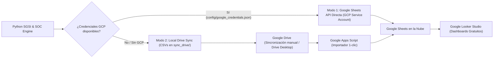

# Guía Completa de Conexión y Dashboards en Google Looker Studio & Google Sheets

Este documento detalla las **2 alternativas de conexión** disponibles en el framework para sincronizar tus datos con el ecosistema de Google sin costos, y cómo construir los dashboards de **SOC** y **SGSI** en **Google Looker Studio**.

---

## 🔄 Métodos de Sincronización Soportados

El framework incluye un sistema de **Sincronización Dual Inteligente**:



---

### Opción A: Modo Directo vía API de Google Cloud (Service Account Gratuita)

Ideal si tienes una cuenta de Google Cloud (capa siempre gratuita).

1. Crea un proyecto gratuito en [Google Cloud Console](https://console.cloud.google.com/).
2. Habilita las APIs: **Google Sheets API** y **Google Drive API**.
3. Ve a **IAM & Admin** > **Cuentas de Servicio (Service Accounts)** > Crea una cuenta de servicio (ej. `sgsi-soc-service`).
4. Genera una clave en formato **JSON** y descárgala en tu proyecto como:
   `sgsi_soc_framework/config/google_credentials.json`
5. Ejecuta la sincronización con tu correo de Google para otorgarte permisos de edición:
   ```bash
   python main.py --action sync --sync-mode service_account --share-email tu_correo@gmail.com
   ```
6. El script creará automáticamente la hoja `SGSI_SOC_Master_Database` en tu Drive y actualizará todas las pestañas.

---

### Opción B: Modo Local Drive Sync (100% Sin Google Cloud Platform)

Si **no tienes cuenta de GCP**, no necesitas configurar nada:

1. Ejecuta el comando de sincronización:
   ```bash
   python main.py --action sync
   ```
   *Esto generará automáticamente los 4 archivos normalizados en la carpeta `sync_drive/`:*
   - `01_inventario_activos.csv`
   - `02_matriz_riesgos.csv`
   - `03_soa_iso27001.csv`
   - `04_registro_incidentes.csv`
2. **Sincronización con Google Drive:**
   - **Método 1 (Manual / Google Drive Desktop):** Sube la carpeta `sync_drive/` a tu Google Drive.
   - **Método 2 (Google Apps Script):** En tu hoja de cálculo de Google Sheets, ve a `Extensiones` > `Apps Script`, pega el código de [`dashboards/google_apps_script_sync.js`](file:///C:/Users/RICARDO.ALFARO/.gemini/antigravity/scratch/sgsi_soc_framework/dashboards/google_apps_script_sync.js) y haz clic en Ejecutar. Esto poblará tus hojas en 1 clic.

---

## 📊 Construcción de Dashboards en Google Looker Studio

Una vez que tus datos estén en Google Sheets:

1. Ingresa a [lookerstudio.google.com](https://lookerstudio.google.com/).
2. Haz clic en **Crear** > **Informe** y selecciona el conector gratuito **Google Sheets**.
3. Selecciona tu hoja maestra y vincula las pestañas.

### 1. Panel de Monitoreo SOC (Centro de Operaciones de Seguridad)
- **Scorecards:**
  - `Total Incidentes` (Recuento de `ID_Incidente`).
  - `MTTD Promedio` (Promedio de `MTTD_Minutos`).
  - `MTTR Promedio` (Promedio de `MTTR_Minutos` donde `Estado = 'Cerrado'`).
  - `Incidentes Críticos Abiertos` (Filtro `Severidad = 'Crítica'` y `Estado != 'Cerrado'`).
- **Gráfico de Donut:** `Severidad` vs `Recuento de Incidentes`.
- **Gráfico de Barras:** Top de `Tipo_Amenaza` detectadas.
- **Matriz de Ataques MITRE ATT&CK:** Eje Y `Tactica_MITRE`, desglose `Tecnica_MITRE`.
- **Tabla en Vivo de Incidentes:** `Fecha_Hora`, `Titulo_Incidente`, `Severidad`, `Estado`, `IP_Origen`, `IP_Destino_Activo`, `Accion_Correctiva`.

### 2. Panel Ejecutivo SGSI (Cumplimiento ISO 27001 & Riesgos)
- **Gauge de Cumplimiento ISO 27001:** Promedio de `Porcentaje_Madurez` sobre los 93 controles de la norma.
- **Gráfico de Barras Apiladas:** Controles por `Dominio` (Organizacional, Personas, Físico, Tecnológico) desglosados por `Estado_Implementacion`.
- **Mapa de Calor de Riesgos ISO 27005:** Gráfico de dispersión `Probabilidad_Residual_1a5` (Eje X) vs `Impacto_Residual_1a5` (Eje Y).
